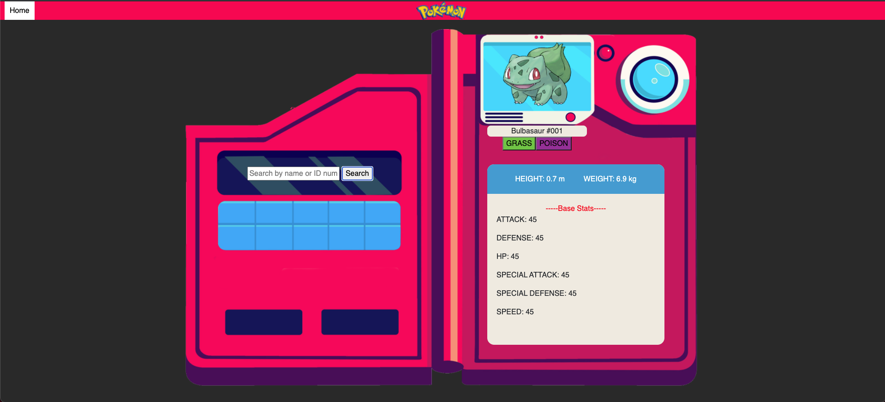
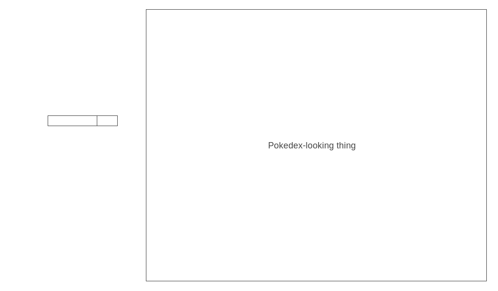
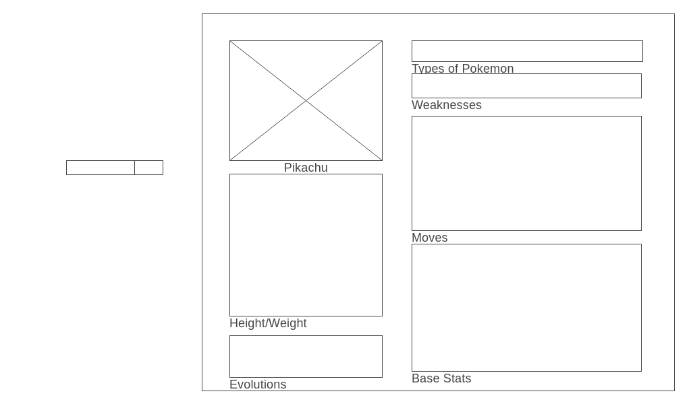

# Pokedex

### Screenshots

### Technologies & Code Snippets 
*HTML
*CSS
*Javascript

![HTML]
![CSS]
![Javascript]

### User Stories & Wireframes
The users can search for their desired pokemon in Generation 1 either by their name or their pokemon ID to find information such as their base stats or types. The search bar is always visible, so the user can then search for other pokemon if they wish to navigate to other pokemon. 

Wireframe for landing page:

Wireframe for the results:

### Unsolved problems/Major Hurdles
The biggest hurdle I had to overcome was the CSS design of the project. As I was using a background image I struggled to align my items exactly as I envisioned as there were many moving parts that I had to update with the search results. I started with a grid format for my entire page, but through the suggestions of a few people, I redesigned the format of the body to a flex design, while keeping the pokedex itself in a grid design. The flex design allowed me to center my images in a much simpler way, while also keeping the complexity of the grid design in the inner element.

The biggest unsolved problem is also in regards to the CSS design of the project. I still have to make the website responsive to different screen sizes as the background image does not resize well depending on even just browser size. This is due to the fact that I had the background image as a background image element, and the sizing was manually adjusted to fit the screen such that it did not look stretched out. 

### Future Development
Currently the pokedex only works for Generation 1 Pokemons. The natural next step would be to extend this functionality beyond the first generation for users to easily search according to generation as well. Future iterations of the pokedex would fix the CSS design issues and add more functionality including the ability to search through different evolutions of pokemon and compare pokemons.